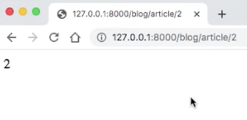

+++
title = 'Django Web Development Chatbot'
date = 2024-11-02T04:32:10-00:00
draft = false
tags = ['Django', 'Web']
showTableOfContents = true

+++

Download `Django` and use it to build a web application with chat functionality. Start by creating a folder named `my_project` by running the command `django-admin startproject my_project`. Once we run this command, Django will generate a new folder named my_project, setting up the essential files and structure needed to begin development.

In a Django project, we can have multiple apps, each with a specific purpose. These apps should be related to each other in a way that supports the overall functionality of the project. Type `python manage.py startapp blog` to build one app called blog. 

A folder named blog is created, containing files like admin.py, apps.py, models.py, views.py, and more. 
- admin.py: Manages the integration with Django’s admin interface, allowing for authentication and administrative functions.
- models.py: A crucial file that defines data models for the app, such as users, comments, and other entities that need to be stored in the database.
- views.py: Contains functions that control what users see by rendering templates and handling logic for different pages.
- Migrations: These files handle database changes, allowing us to create and modify database structures as the models evolve.

To run the Django project, execute `python manage.py runserver` in the terminal:

## Create urls for new app 

Create urls.py in the blog App Directory. Remember to import views from the `views.py` in the current directory. The name of the first url is 'index'. The first parameter, `''`, is an empty string, meaning this pattern matches the "root" URL for the app.  

`views.index` refers to a view function named index in the views.py file of the current blog app. The index function defines what should be displayed when a user visits the app's root URL. For example, it might return an HTML template or JSON data.

The name parameter or `name='index'` is a unique name for this URL pattern. It's used to refer to this path in templates and other parts of the code. We can use this name to generate URLs within Django templates like ``.

```
# blog/urls.py
from django.urls import path
from . import views

urlpatterns = [
    path('', views.index, name='index'),
]
```

Then we need to tell our project or main app that we have this new url in urls.py of app blog. Open urls.py file in main project folder my_project. If we set this app's URL pattern as `path('blog/', include('blog.urls'))` in the **main urls.py**, then this empty string'' will match `yourwebsite.com/blog/`.


```
# my_project/urls.py
from django.contrib import admin
from django.urls import path, include 

urlpatterns = [
    path('admin/', admin.site.urls),
    path('blog/', include('blog.urls')) # add path tp the main urls.py, include blog app urls.py
]
```

## Build view function for new url

If we open views.py in blog folder, there is nothing here now. We want to create this index function so it can be called in blog/urls.py file.
```
# blog/views.py
def index(request):
    # use HttpResponse to return something first 
    return HttpResponse("This is my first url")
```
 The first url can be found in `my_project/urls.py` and `blog/urls.py`. The index function built in `blog/views.py` is called in `blog/urls.py`.View the display on `http://127.0.0.1:8000/blog/`:
 

To define a new URL in Django, follow these steps:
- Add a URL in the Main urls.py: in `my_project/urls.py`, add a new URL pattern inside the urlpatterns list.
  - Whenever a new app is created, you should also include its URLs here to make them accessible in the main project.
- Define URLs in the App's urls.py: Go to the urls.py file in the specific app folder.create one or more URL patterns within the urlpatterns list specifically for that app.
  - If the path string is empty (''), it represents the root URL for that app.
  - If the path string is set to something like 'specific', you can access it through root_path/specific/.
- Create a view function in app_folder/views.py to handle requests for the new page associated with the newly created URL.
  - This function can return a string, number, list, or other data types.

 


## Build view functions for displaying

If we want to create multple number inserted url paths, we can create one path for article ids like `<int:article_id>` for passing one integer in the url, and then in views.py we define the article function with article_id parameter. 
 
<div style="display: flex; gap: 10px;">
    
    
</div>


## Leverage HTML and CSS

In the blog app folder, create a folder named `templates`, and within it, create another folder named `blog`. Inside this blog folder, add the first HTML file, `index.html`. We can render this HTML view in views.py of the blog app by using `render(request, 'blog/index.html', {'article_id': article_id})`. 

```
 def article(request, article_id):
     return render(request, 'blog/index.html', {'article_id': article_id})
```
- request: the current HTTP request.
- 'blog/index.html': the path to the HTML template.
- {'article_id': article_id}: a context dictionary that passes article_id to the template.

Afterwards, it's important to add in element `blog.apps.BlogConfig` in `INSTALLED_APPS` list of the` settings.py` of the main project folder. 

- App Recognition: Adding blog.apps.BlogConfig registers the app with Django, making it aware of this app.
- Template & Static Files: Django loads templates and static files only from registered apps.
- Database Models: Django includes models from registered apps during migrations to set up database tables.


