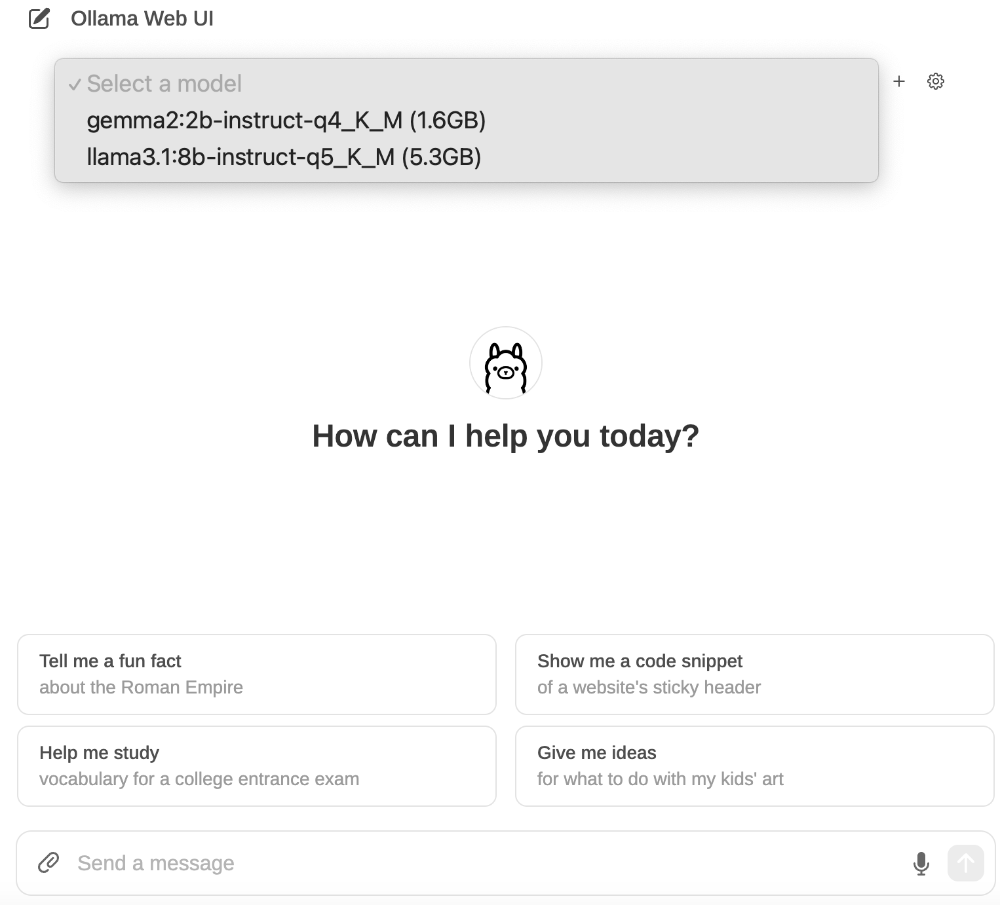
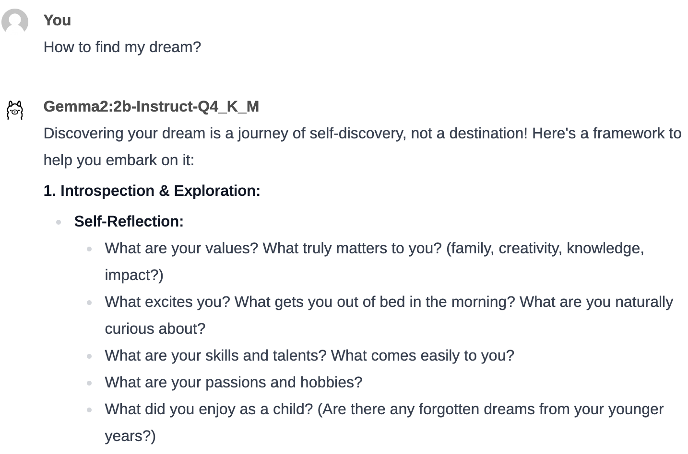

+++
title = 'Build Own ChatGPT: A Simple How-To'
date = 2024-08-12T03:56:00-00:00
draft = false
tags = ['LLM', 'Ollama']
showTableOfContents = true

+++

<sub>Updated Ollama Web UI on 2024-Aug-24</sub>


## Download Ollama and Run Commands

Ollama is a versatile tool that offers a range of language models with detailed specifications. To get started, [download Ollama](https://ollama.com/download) and explore the different models available on the Ollama website. Once downloaded, you can use Ollama commands in your terminal.

Run `ollama` to see the available commands:


On the [llama3.1 download page](https://ollama.com/library/llama3.1:8b-instruct-q4_K_M/blobs/11ce4ee3e170), you can find a list of llama3.1 models. There are also comparisons made for different types of models.

## LLM Sizes, Types, and Quantizations

In the context of large language models (LLMs):

- Chat: Direct conversation with the model, where the character card serves as your prompt.
- Instruct: A chat between "you" and the "assistant," following the model's prompt format.
- Chat-Instruct: A conversation where you interact with a character card using the instruct template. For example, "You are an AI playing [X character]; respond as the character would." This is then adapted to formats like Alpaca, Wizard, etc.

There is no definitive "best" option, but for factual information, instruct mode is typically more reliable. However, instruct-chat doesn't necessarily improve character portrayal or produce longer responses. One may work better than the other for a particular model and prompt.

For more information on model suffixes and quantization in LLMs, visit [this page](https://www.reddit.com/r/LocalLLaMA/comments/17lavtr/how_do_i_choose_the_llama_model_its_so_confusing/). For performance statistics on different model sizes and quantizations, check [this comment](https://github.com/ggerganov/llama.cpp/pull/1684#issuecomment-1579252501).

Let's select one instruct small model and download it using ollama with this command: `ollama run llama3.1:8b-instruct-q5_K_M`

 
We can interact with Ollama directly using the terminal. 
 

Now we can send questions directly or use the curl command to interact with the LLM using ollama. 
`curl` is a command-line tool used to send requests to URLs. `http://localhost:11434/api/generate` is the URL endpoint of the local server running on the machine (localhost) at port 11434. The /api/generate path indicates that this request is related to generation exposed by ollama. 

```
curl http://localhost:11434/api/generate -d '{
"model": "gemma2:2b-instruct-q4_K_M",
"prompt": "what is water made of?",
"stream": false
}' | jq .
```
- `d` stands for "data" we are passing and is used to send the specified data in a POST request.
- The data contains arguments for ollama (JSON object with three key-value pairs).
- "stream" false means instead of streaming back one word at a time, we want everything all at once.
- The `|` is a pipe that takes the output of the `curl` command and passes it to another command.
- `jq` is a command-line utility for parsing and processing JSON data. `.` tells `jq` to output the entire JSON response, formatted for easy reading. 


## View Modelfile, System, and Template

Run `ollama show model_name --modelfile` to view the modelfile, relevant description, how the model works, and where it lives. 

`ollama show gemma2:2b-instruct-q4_K_M --modelfile`

- TEMPLATE: Displays the system prompt if it exists.
- SYSTEM: Describes the chat scenario between a user and an AI assistant.

To create a custom system prompt for a selected model, first copy the modelfile into your own file called `new-modelfile`. Let's say the model is `gemma2:2b-instruct-q4_K_M`. 
Use the command `ollama show gemma2:2b-instruct-q4_K_M --modelfile > new-modelfile` to copy the modelfile to the new file. Then modify and save this new-modelfile file with the updated system prompt. Finally, create a new model from the updated modelfile using `ollama create new-gemma2_2b_instruct —-file new-modelfile`. Run `ollama run gemma2_2b_instruct` to interact with the updated model!


## Run LLMs with Ollama 

Download the `ollama` Python package, `import ollama`, and then view the details with `ollama.list()` 

<details>
<summary>
<b>View model details in the list.</b>
</summary>


</details>


## Build Custom System Prompt 

To create a new model file from an existing model, you can follow these steps. This process involves copying the model file using the `>` operator and creating `new-modelfile` using Ollama.

Start by copying the modelfile into a new file named new-modelfile. You can do this by running the following command in your terminal: `ollama show gemma2:2b-instruct-q4_K_M --modelfile > new-modelfile`
This command will extract the model file for `gemma2:2b-instruct-q4_K_M` and save it as new-modelfile in your current directory. 

To view the contents of the newly created new-modelfile, use the cat command:`cat new-modelfile`. To confirm where the new-modelfile has been saved, you can use the `pwd` command to print the current working directory. 

<details>

<summary>
<b>How to edit modelfile in Visual Studio Code.</b>
</summary>
If you want to edit the model file using Visual Studio Code, start by enabling the command to open files directly from the terminal. Open the Command Palette by pressing `Cmd+Shift+P` (Mac), type Shell Command, and select Install 'code' command in PATH. Once enabled, you can open the new-modelfile by running the command: `code new-modelfile` to open this file. After opening the file, you can add a custom prompt or make other modifications to the downloaded language model.

```
pwd
code new-modelfile
```
</details>


## Run Docker Image for Ollama Web UI 

We can create an environment that can execute applications consistently across different systems using Docker. Using Docker for this chatbot UI provides a stable and isolated environment, ensuring the application runs smoothly across multiple systems. It simplifies setup, encapsulates dependencies, and allows for easy deployment with a single command. Docker also enables data persistence, scalability, and enhanced security, making it an ideal choice for managing your chatbot interface efficiently.

<details>
<summary>
<b>View to code to run a Docker container for Ollama Web UI</b>
</summary>

```
docker run -d -p 3000:8080 \
--add-host=host.docker.internal:host-gateway \
-v ollama-webui:/app/backend/data \
--name ollama-webui \
--restart always \
ghcr.io/ollama-webui/ollama-webui:main
```
- docker run: Creates a new container.
- -d: Runs the container in the background (detached mode).
- -p 3000:8080: Maps host port 3000 to container port 8080.
- --add-host=host.docker.internal:host-gateway: Allows the container to access services on the host machine.
- -v: Creates a volume (ollama-webui) to persist data between sessions.
- --name: Names the container ollama-webui for easy identification.
- --restart always: Ensures the container restarts automatically if it stops.
- Image: ghcr.io/ollama-webui/ollama-webui:main specifies the main branch of the Ollama Web UI container image.

</details>

After running the above command, if you see the message "Unable to find image 'ghcr.io/ollama-webui/ollama-webui locally, main: Pulling from ollama-webui/ollama-webui," the image will then be downloaded. Once completed, run `docker ps` to display all running containers.
```
CONTAINER ID   IMAGE                                    COMMAND           CREATED         STATUS         PORTS                    NAMES
4b7938e75eac   ghcr.io/ollama-webui/ollama-webui:main   "bash start.sh"   2 minutes ago   Up 2 minutes   0.0.0.0:3000->8080/tcp   ollama-webui
```

You can now access the web UI at http://127.0.0.1:3000/auth/. After signing up with a mock email address, you can select the locally downloaded model and start asking questions. Enjoy exploring!


<details>
<summary>
<b>Sign up and interact with Ollama Web UI</b>
</summary>



</details>

There are other ways to build our own chatbot UI. For example, we can also explore Streamlit to integrate chat history and provide options to select different local models.