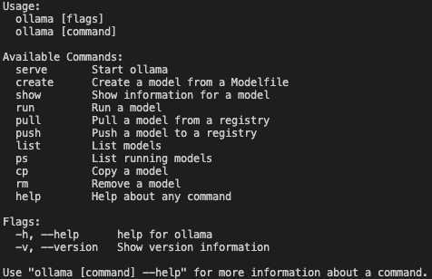
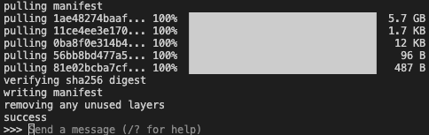
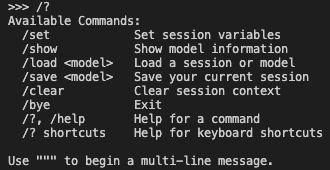
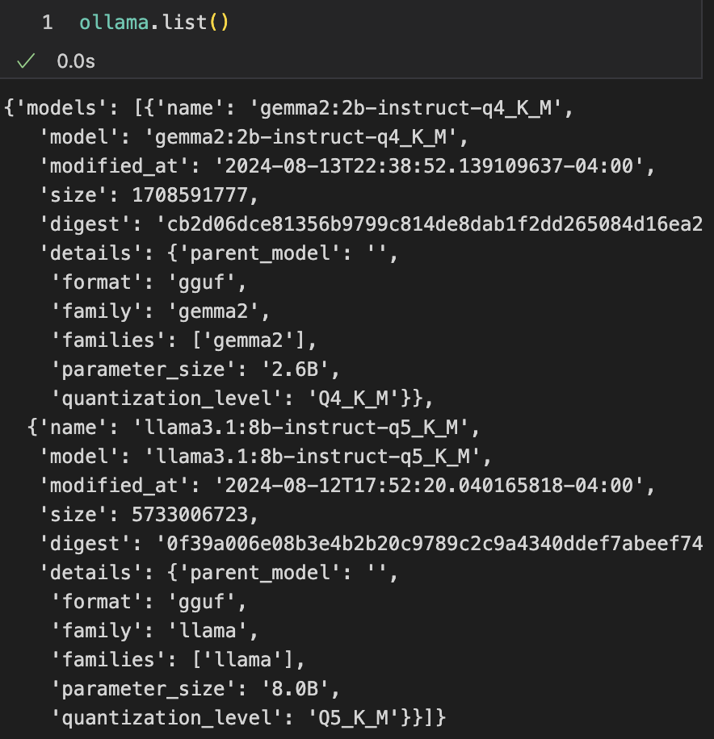

+++
title = 'Build Own ChatGPT: An Easy How-To'
date = 2024-08-12T16:16:00-00:00
draft = false
tags = ['LLM', 'Ollama']
showTableOfContents = true

+++


## Download Ollama and Run Commands

Ollama is a versatile tool that offers a range of language models with detailed specifications. To get started, [download Ollama](https://ollama.com/download) and explore the different models available on the Ollama website. From now, we are able to use Ollama commands in our terminals. 

Run `ollama`, then we are able to see available commands:


Here we can find a list of llama3.1 models listed in [llama3.1 download page](https://ollama.com/library/llama3.1:8b-instruct-q4_K_M/blobs/11ce4ee3e170) There are some comparisons made fir dufferebt types of

## LLM Sizes, Types and Quantizations

In the context of large language models (LLMs):

- Chat: Direct conversation with the model, where the character card serves as your prompt.
- Instruct: A chat between "you" and the "assistant," following the model's prompt format.
- Chat-Instruct: A conversation where you interact with a character card using the instruct template. For example, "You are an AI playing [X character]; respond as the character would." This is then adapted to formats like Alpaca, Wizard, etc.

There is no definitive "best" option, but for factual information, instruct mode is typically more reliable. However, instruct-chat doesn't necessarily improve character portrayal or produce longer responses. one may work better than the other for a particular model and prompt.

For more information on model suffixes and quantization in LLMs, visit [this page](https://www.reddit.com/r/LocalLLaMA/comments/17lavtr/how_do_i_choose_the_llama_model_its_so_confusing/). For performance statistics on different model sizes and quantizations, check [this comment](https://github.com/ggerganov/llama.cpp/pull/1684#issuecomment-1579252501) 


Let's select one instruct small model and download it using ollama with this command `ollama run llama3.1:8b-instruct-q5_K_M`

 
We can interact with Ollama directly using terminal. 
 

Now we can send questions directly or use curl command to interact LLM using ollama. 
`curl` is a command-line tool used to send requests to URLs. `http://localhost:11434/api/generate` is the URL endpoint of the local server running on the machine (localhost) at port 11434. The /api/generate path indicates that this request is related to generation exposed by ollama. 

```
curl http://localhost:11434/api/generate -d '{
"model": "gemma2:2b-instruct-q4_K_M",
"prompt": "what is water made of?",
"stream": false
}' | jq .
```
- `d` stands for "data" we are passing and is used to send the specified data in a POST request.
- The data contains arguments for ollama (JSON object with three key-value pairs)
- "stream" false means instead of streaming back one word at a time, we want everything all at once.
- The `|` is a pipe that takes the output of the `curl` command and passes it to another command.
- `jq` is a command-line utility for parsing and processing JSON data. `.` tells `jq` to output the entire JSON response, formatted for easy reading. 


## View Modelfile, System and Template

Run `ollama show model_name --modelfile` to view modelfile, relevant describtion, how the model works and where it lives. 

`ollama show gemma2:2b-instruct-q4_K_M --modelfile`

- TEMPLATE: Displays the system prompt if it exists.
- SYSTEM: Describes the chat scenario between a user and an AI assistant.

How to create a custom system prompt for one selected model? we need to first copy the modelfile into our own file new-modelfile. Let's say the model is `phi`. 
`ollama show phi --modelfile > new-modelfile` here `>` means copy the modelfile to a new file new-modelfile. Then modify and save this new-modelfile file with updated system prompt. Finally, create a new model from the updated modelfile using `ollama create new-phi —-file new-modelfile`. Run `ollama run new-phi` to interact with the updated model!


## Run Chat

Download to `import ollama` python package and view the details with `ollama.list()` 

<details>

<summary>
<b>Click to view model details in the list.</b>
</summary>



</details>