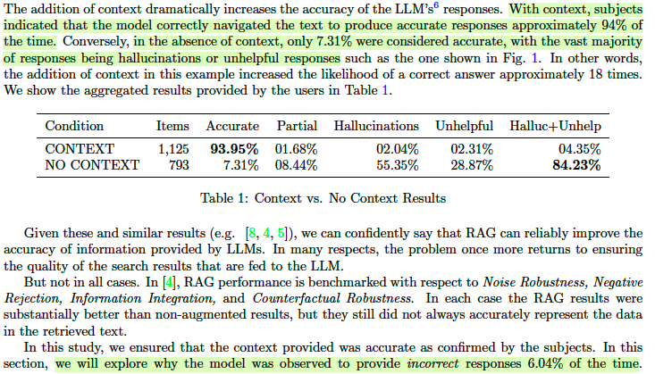

+++
title = 'The Double-Edged Sword of RAG Chatbots'
date = 2024-07-16T16:16:56-04:00
draft = false
tags = ['Literature Review', 'RAG', 'LLM']
showReadingTime = false
showTableOfContents = true

+++

This post primarily discusses the challenges faced by RAG, as explored in [the paper](https://arxiv.org/abs/2403.01193), and shares some insights from a practical perspective.

The paper addresses the persistent issue of hallucination, where large language models tend to generate false information. **These hallucinations pose significant challenges in fields requiring high levels of accuracy and precision, such as healthcare, finance, and law.** The critical nature of this problem is underscored by recent court cases where ChatGPT produced citations of non-existent legal rulings. The discussion delves into the ongoing challenges that Retrieval-Augmented Generation (RAG) faces in practice, the inherent complexity of hallucinations, and the implications for deploying RAG LLMs in real-world scenarios.

## Experimental Method

>To minimize this issue, we designed an experiment where academics review their own educational background, work experience, and publications using their curriculum vitae. The CV serves as a best-case proxy for search results from a fully-functional RAG system.

Here, The experimental method introduces a scenario involving academic CV reviews. In the experiment, CV is assumed to represent the ideal output that a fully-functional RAG system could produce. In this setup, we can eliminate the uncertainties that RAG itself could introduce, allowing for a deeper exploration of the hallucination problem in LLMs.

### Experiment Steps 

1. Collected CVs and responses from academic community members.
2. Subjects then uploaded their CVs along with demographic information, including names and current institutions. This information was used to build the prompts.
3. Once loaded, the subjects were guided through a series of interactions with the LLM.

### Control Variables:

The subjects were presented with three prompt/response pairs under two different conditions. In each case, the participant's name and institution were used. 
- In Condition 1, the CV was not included as context.
- While in Condition 2, it was included.

Participants were randomly assigned to either the "with context" or "without context" setting. All tests were conducted using the OpenAI GPT-3.5-turbo-16k-0613 model, which supports up to 16,000 tokens, suitable for particularly long CVs.

## Results

Out of a total of 1,125 items, 68 were identified as incorrect by the users reviewing the responses. Why are we still unable to capture the correct information?

### Noisy Context and Addtional Content

This is the most common error in context-based response augmentation. **GPT3.5 occasionally generates responses using context from one section but continues into the next section instead of stopping after retrieving the relevant information from the prompt.** For example, the generated text for the "Education" section might incorrectly include information from the "Work History" section.

It was also observed that GPT3.5 **does not always strictly follow the instructions provided in the user prompt**. Sometimes it introduces irrelevant or partially related context, and at other times, it fails to adhere to the specified number of items mentioned in the prompt.

### Mismatches, Unusual Formatting and Incomplete Context

In several instances, **the prompt’s query and the provided context were not fully aligned** for the model to extract an accurate answer. Besides, it was observed that the model did not correctly capture or "understand" the information in the prompt, sometimes mistaking educational background for work experience.

The model **"creatively" filled in the gaps by generating a list of jobs for the empty section**. It added fabricated jobs that seemed more credible by drawing on information from the education and publication histories to create a believable sequence. This highlights that the model's "hallucinations" can be more difficult to detect and that the model's and humans' interpretations of certain items might differ.

Due to the unique formatting of dates in the CV, the model occasionally **misassigned dates to the wrong experiences**. Some CVs included links, but since the model cannot access external web information, it **generated responses that users considered incomplete**, as they didn’t provide any details beyond the given context.

## Perspectives 

LLM systems cannot fully serve as reliable "libraries" for information retrieval; they still produce varying degrees of hallucinations and errors. RAG (Retrieval-Augmented Generation) has become a popular method to reduce these hallucinations. RAGs dynamically retrieve and incorporate data from external sources based on the user’s query. By indexing similar text chunks, we provide LLMs with supplementary information to help generate more accurate responses. However, it’s important to acknowledge that RAG itself has limitations: 
- Firstly, does the text indexed by RAG truly contain relevant content to assist in generating accurate responses? This research has shown that in the presence of complex or misleading search results, a RAG system may often get things wrong.
- Secondly, trained GPT model constrained by its training data. As mentioned in the paper, Emily Bender’s octopus analogy illustrates this well—where an intelligent octopus (standing in for an LLM) has learned to imitate human communication solely based on statistical patterns in intercepted undersea cable transmissions. 

LLMs can indeed accelerate development and productization, replacing some basic to intermediate NLP tasks. They are most accurate when operating within domains where the training set contains many correct and largely aligned examples. However, if our data includes conflicting sources or is contaminated with inaccurate information, the models will struggle to produce reliable content. Additionally, we need to keep in mind that the statistical patterns in the training data and a single large language model cannot fully capture the contextual nuances and specialized knowledge required for a specific industry.

## Reminders

Given the potential error rate of RAG systems, we need to consider what level of accuracy is acceptable for our real-world scenarios. When dealing with large volumes of data, the scale of this issue becomes more apparent. For example, in 2023, an estimated 8.5 billion Google searches were conducted daily. An equivalent advanced RAG system could potentially generate misleading or incorrect information around 500 million results per day. And this doesn’t even account for additional uncertainties and noisy data introduced in real-world applications.

Therefore, relying entirely on LLMs would be overly optimistic. LLMs are great foundational tools for generating results, and I think it is essential to combine them with well-defined business rules and customized machine learning algorithms to develop a system that is both easy to monitor and evaluate.

