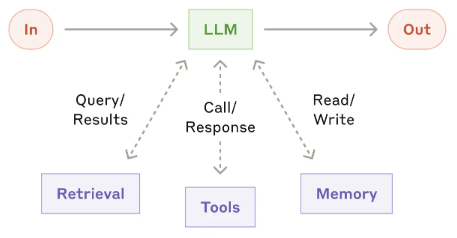
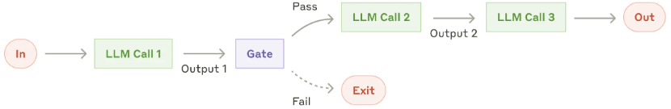
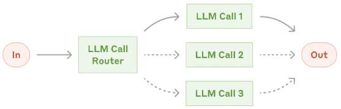
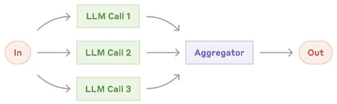
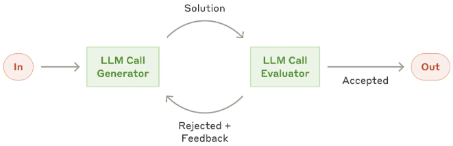
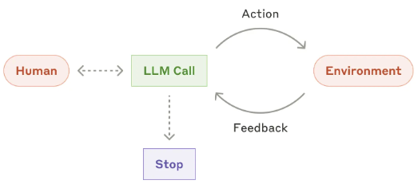

+++
title = 'Generative AI Development Strategies and Patterns'
date = 2025-01-03T10:10:10-00:00
draft = false
tags = ['Generative AI', 'LLM', 'Strategy', 'Agentic System']
showTableOfContents = true

+++
Updated LLM workflows and agentic system content as of 2025-Feb-28

## Strategies for the AI Era

AI embodies distinct capabilities rather than functionalities. Developing the right AI capabilities and assembling complementary teams are essential.
A key question is how to design a system centered on AI memory and retrieval contexts, tailored to the needs of diverse users. Training LLMs will persist, even when encountering a scaling wall where enhancing intelligence becomes increasingly challenging at high-inteligent levels. Smarter training with high-quality data can further unlock improvements and ultimately reach the critical tipping point, significantly transforming everyday life.

For AI enterprises, building own foundation model marks a critical milestone. These large-scale models serve as the operating systems and programming languages of the AI era, powering superproducts akin to current semiconductors and acting as gateways to next-generation devices.

For AI start-ups, the focus should be on envisioning the products that will shape and integrate into people’s lives over the next 3-5 years, then working backward to identify the technologies needed to realize these innovations.

The potential of the robotic AI industry is constrained by challenges in both AI algorithms and robotics. Robotics has not yet reached a technological tipping point, with most efforts centered on open-source and collaborative innovation. Developing robotic hardware requires significant hands-on experience and a longer learning curve, though the industry is relatively standardized for new learners. In contrast, AI algorithm development relies on a small pool of leading research labs, with algorithmic limitations now presenting greater challenges than hardware. To create AI robots that genuinely enhance daily life, we need not only [semantic intelligence but also physical intelligence](https://www.bilibili.com/video/BV1yM4m1D7tC/?spm_id_from=333.337.search-card.all.click&vd_source=2ebd024eac0b9cf1de30b74eb35caaf8) to perform real-world tasks (e.g., understanding principles like Newton’s laws and achieving precise control).

Recognize that consumer acceptance of electronic products is a gradual process. It's important to evaluate a product from a higher perspective see whether one product has the potential to become a common category in society in the future.  When innovating in consumer electronics, start by thoroughly understanding the current market landscape. Identify popular products and pinpoint unmet or unsatisfied needs that could be addressed to provide additional value. Building upon the success of existing products can be a strategic and reliable approach to attracting new customers. 

## Models & Algorithms Development

When developing AI algorithms and predictive models, it is important to first assess whether the task at hand is best addressed using rules-based systems, traditional machine learning, or generative AI algorithms. In factory or enterprise settings, classic automation solutions ca neb cost-effective, as these environments typically feature well-defined scenarios. For consumer-facing applications, the situation is more complex. It involves diverse contexts, ethical considerations, and "last-mile" challenges, which require additional time and effort to resolve. One approach is to focus on improving existing popular products, enhancing them to deliver even greater value.

Avoid blindly following scaling laws. In the field of LLMs or NLP, researchers have demonstrated the effects of scaling laws on next-token generation tasks through experiments with GPT2 and GPT3 models. However, in other domains, it is more prudent to first validate methods with smaller datasets and models rather than focusing solely on scaling up data and model size.

What will the next groundbreaking architecture be? It’s hard to predict. It often takes 4-5 years for practitioners and researchers to identify a truly transformative foundational architecture. For example, diffusion models introduced in 2015 and transformers proposed in 2017 have only been recognized as revolutionary advancements in the last few years.  The Transformer architecture demonstrated its effectiveness in processing large datasets using GPUs. One advanced architecture should excel at identifying the most relevant information within large datasets.

## Augumented LLM and Worflows

This part is summarized from [Building Effective Agents](https://www.anthropic.com/research/building-effective-agents) article by Antropic. 

Agengtic framework like Langchain or Amazon Bedrock simplify the procss of building agentic systems, but they also add extra layers of abstraction,, which can obscure the underlying prompts and responses, making debugging more difficult. A better approach is to start with direct LLM API usage and only adopt one framework when it's truly needed and well understood.

Until now, key building blocks and workflows for constructing agentic systems have been proposed to enhance LLMs with three essential components:
. 
- *Retrieval*: retrieve relevant information from one or more knowledge databases to reduce hullicinations.
- *Tools*: integrates external tools like search, translation, and/or other business related APIs to expand capabilities.
- *Memory*: structures chat history to refine and improve LLM responses over time.

### LLM Prompt chaining

Prompt chaining breaks down a larger task into smaller and sequential steps, where each LLM call processes the output of the previous one. Programmatic checks, referred to as "gates" in the diagram below, can be applied at any intermediate step to ensure the process remains on track. However, the total time spent on these checks and the number of iterations should be carefully considered to effectively manage costs.

 

This workflow is best suited for situations where tasks can be decomposed as more detailed and specific smaller tasks. In this approach, we trade latency for higher accuracy by making each LLM call an smaller specific task.

Some examples of using this workflow include:
- Creating a promotional post on X, translating it into multiple languages, and adding humorous emojis and images.
- Writing a document outline, verifying that it meets certain criteria, and then drafting the document based on the outline.
- Analyzing user input actionable items, identifying potential gaps, and consolidating these elements into a well-designed action plan.

### Routing with Classifications

We can use traditional ML models to classify an input and direct it to a specialized follow-up task. This workflow is designed to separate tasks based on different factors and address user requests with more specialized prompts. Without this approach, optimizing for one type of input at a time may negatively impact the overall performance.

This routing workflow works best when we see more distinct patterns in inputs so we can handle these requests separately. The classification can be handled accurately, either by an LLM or a more traditional classification model or algorithm.

Examples where routing is beneficial:
- Directing various customer service requests (such as general inquiries, refund requests, or technical support) to the appropriate downstream processes, prompts, and tools.
- Routing common questions to smaller models like Claude 3.5 Haiku/GPT-4o, while reserving more complex queries for more advanced models like Claude 3.7 Sonnet/GPT-4 to optimize both cost and speed.

### Parallel LLM Calls

Sometimes, we may need to run the same task multiple times with LLMs to aggregate output scores or generate more diverse results from these iterations.

This workflow is especially valuable when multiple perspectives are needed to boost confidence in the results. It is similar to bootstrapping in statistics, but LLM outputs are generative in nature. We can leverage prompt engineering to let LLM come up quantitative scores, which facilitate the agregation process.

Some examples of how this can be applied in evaluation include:

- Implementing guardrails where one model instance processes user queries, while another screens them for inappropriate content or requests. This approach could outperform using a single LLM to handle both the guardrails and core response.
- Automating evaluations to assess LLM performance, where each LLM call evaluates a different aspect of the model’s performance on a given customized prompt.
- Reviewing a piece of code for vulnerabilities, with multiple prompts examining and flagging any issues they find.
- Evaluating whether a given piece of content is inappropriate, using multiple prompts to assess different aspects or set up voting thresholds to access Evaluating whether a piece of content is inappropriate, using multiple prompts to assess false positive and false negative rates.

### Evaluator-optimizer LLMs

In this case, two LLMs are required—one for generation and one for critique. We need to have clear criteria for effective iterative optimization and make sure that iterative refinement actually delivers meaningful value. Two key indicators of successful application: first, that LLM responses show significant improvement when guided by human feedback, and second, that the LLM itself can generate constructive feedback. This process mirrors how a human writer revises drafts to refine and perfect a document.

Examples Where an evaluator-optimizer workflow is useful:
- Literary Translation: Capturing nuanced meanings that a translator LLM might miss on the first pass, while an evaluator LLM provides critiques to refine the translation.
- Complex Search Tasks: Conducting multiple rounds of searching and analysis to ensure comprehensive results, with the evaluator determining whether additional searches are needed.

## Agentic Systems

Agents are designed to work independently on tasks while having the flexibility to seek human input when necessary. During execution, it is essential for agents to gather “ground truth” from their environment at each step—whether through tool call results, code execution, or other means—to evaluate their progress. They can pause for human feedback at predefined checkpoints or when encountering obstacles. While tasks typically conclude upon completion, implementing stopping conditions (such as a maximum number of iterations) helps maintain control and prevent unnecessary loops.

It is essential to design toolsets and their documentation clearly and thoughtfully, while also carefully considering when to use agents. Agents can be used for open-ended problems where the number of required steps is uncertain, and a fixed path is hard to be predicted. The LLM will potentially operate for many iterations, and we must have some level of trust in its decision-making. Agents' autonomy makes them ideal for scaling tasks in trusted environments. However, this autonomy also comes with higher costs and the potential for more errors. Anthropic recommends extensive testing in sandboxed environments, alongside the implementation of appropriate guardrails and prompt engineering.

When implementing agents, Anthropic suggests following these three core principles:
1. Maintain simplicity in agentic system design.
2. Ensure transparency by clearly outlining the agent’s planning steps.
3. Carefully develop the agent-computer interface with thorough tool documentation and testing.
   
Ultimately, success in the LLM space isn't about creating the most sophisticated system; it's about building the right system for our specific needs. Begin with simple prompts, optimize them through thorough evaluation, and introduce multi-step agentic systems only when simpler solutions no longer suffice. Frameworks can help kickstart development, but as we move toward production, it's important to reduce abstraction layers and focus on building with fundamental components.

## Strategies for Personal Growth

The era of AI is bringing rapid changes. How do we navigate these uncertainties and focus on growing during such turbulent times?

First, we must recognize that the world was never designed purely for comfort—difficult times are an inevitable part of life. The key question lies in how we face challenges and the mindset we adopt in doing so. Next, we need to prepare ourselves and condition our minds. Most importantly, instead of running away, we face difficulties head-on, even when they bring discomfort. Embrace difficulties as challenges, and redefine every challenge as one training for growing and expanding. By approaching challenges as training opportunities, we also need to recognize that no one is born a superhero or naturally equipped with strength and confidence. These qualities develop gradually through consistent effort, training, and repetition. Repetition creates mastery. 

Acknowledge that most aspects of life are beyond our control, much like climbing an unknown mountain. Searching for the "perfect path" to the top is often unrealistic. Instead, progress is made step by step: take a step, face challenges, make adjustments, receive feedback, and keep moving forward. It’s essential to maintain a "firm yet flexible goal", approaching each step with thoughtful intention. At the same time, we should not let the perceived negatives distract or deter us from our overarching objective.

Fully accepting our own traits is essential, and understand these traits can have both positive and negative effects. The key is to build based on our traits and [collaborate with others who complement us](https://www.youtube.com/watch?v=mbiPeZnmz9A&t=7940s), forming a stronger team.

[Be proactive in making our own choices.](https://www.goodreads.com/book/show/36072.The_7_Habits_of_Highly_Effective_People) Approach decisions with a positive and proactive mindset, recognizing that we always have the ability to choose. The opposite of "making choices" is "judging right or wrong", it fixates on labeling A or B rather than exploring possibilities. Choosing focuses on evaluating options to determine the better, driven by openness and a growth-oriented perspective. Most importantly, remember that choices are rarely constrained to two options. ["Great insight comes only from opening your mind to many options."](https://sive.rs/options). 
